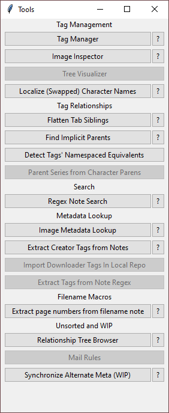
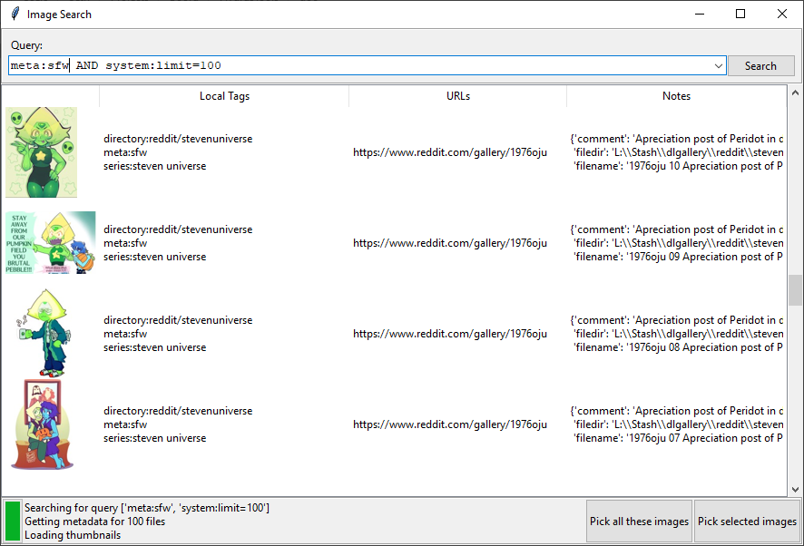
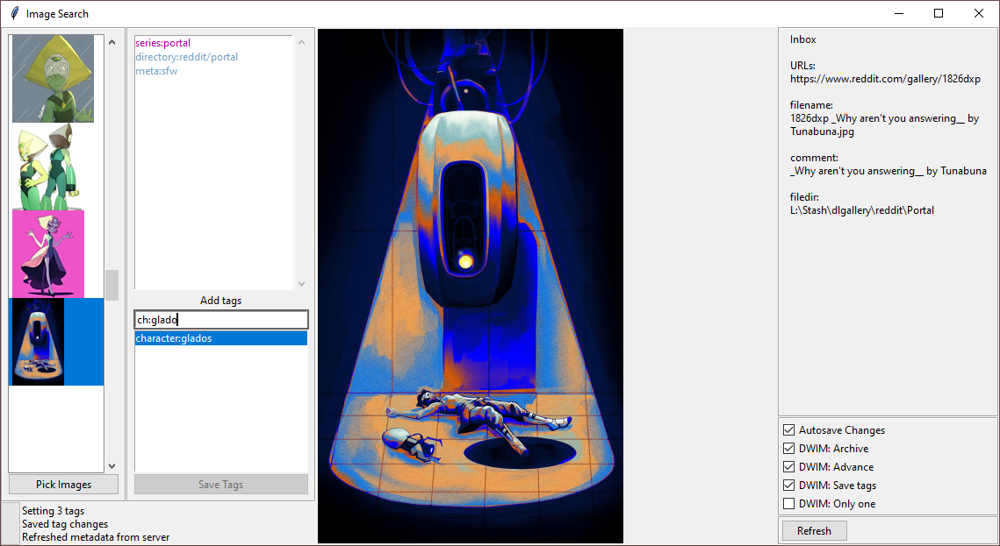

# HydrusTools

Toolkit for interfacing with for a [Hydrus](https://hydrusnetwork.github.io/hydrus/index.html) client over the local API.

Work in progress!

## Documentation

Each tool has built-in documentation. Press the ? button next to the menu entry (or the F1 key within a tool) for the documentation, or see [ToolDocumentation](./ToolDocumentation.md) for an online list.

## Setup

Run the program once to generate a template `HTSettings.ini` file.
Then populate the `hydrus_api_key` and (optionally) `hydrus_api_url` fields.

## Notes

### Running metadata lookup programatically

`venv/Scripts/python.exe -m hydrustools.macro.macro_lookup 'system:inbox AND system:limit is 64 AND system:number of unnamespaced tags < 2'`
